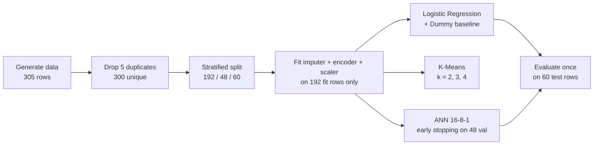
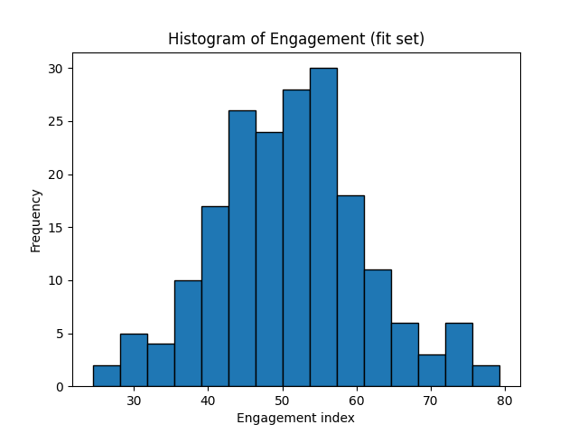
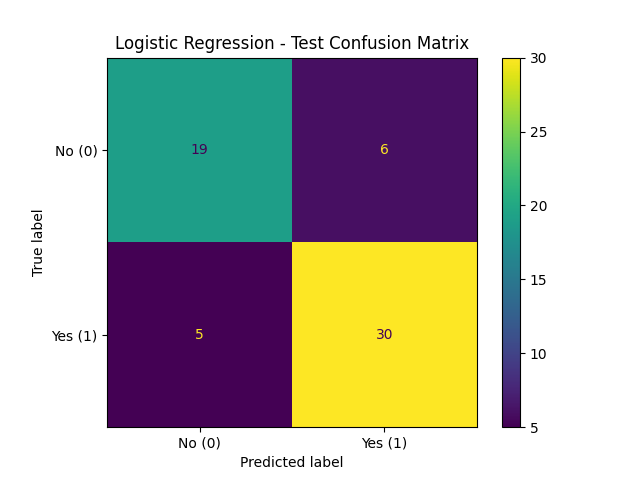
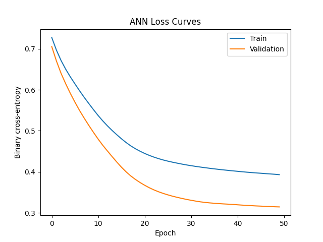
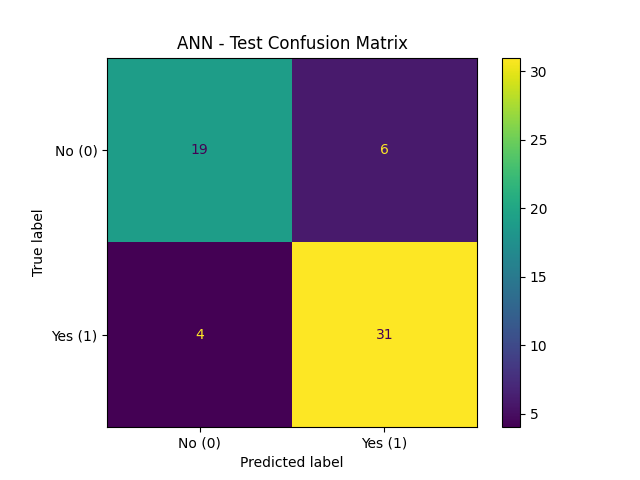

<div align="center">

<a href="https://github.com/krish-desai-123/Mock-Interview-Practical-">
  
</a>

# 🎯 Campaign Response Prediction & Audience Segmentation
### Mock Interview Practical · Round 1 (MIP-1) · Set A

[](https://www.python.org/)
[](https://scikit-learn.org/)
[](https://www.tensorflow.org/)
[](https://scipy.org/)
[]()

*Five modules, one notebook: descriptive stats & inference → leakage-safe preprocessing → logistic regression → K-Means → a small ANN.*

</div>

---

## 🪪 Submission Details

| |                                                        |
|---|--------------------------------------------------------|
| 👤 **Name** | Krish Desai                                            |
| 🆔 **Student ID** | 10061                                                  |
| 🧪 **Set** | A                                                      |
| 🔁 **Round** | 1 (MIP-1)                                              |
| 🐙 **GitHub** | [@krish-desai-123](https://github.com/krish-desai-123) |

---

## 🧭 Table of Contents

- [🎯 Objective](#-objective)
- [🗂️ Dataset & Data Dictionary](#️-dataset--data-dictionary)
- [🔄 Pipeline at a Glance](#-pipeline-at-a-glance)
- [🧪 Module Results](#-module-results)
- [📊 Held-Out Comparison](#-held-out-comparison)
- [💡 Key Findings & Limitations](#-key-findings--limitations)
- [⚙️ Tech Stack](#️-tech-stack)
- [🚀 Getting Started](#-getting-started)
- [📁 Repository Structure](#-repository-structure)
- [🎥 Video Walkthrough](#-video-walkthrough)
- [📚 Declaration](#-declaration)

---

## 🎯 Objective

Predict whether a contact **responds to a marketing campaign** (`response = 1`) and find
**audience segments** in the data, using a small, synthetic dataset. Every step is built to
avoid leakage: all transformers and both predictive models are fitted on the same 192 training
records, the 48 validation records are used only for ANN early stopping, and the 60 test
records are evaluated once.

---

## 🗂️ Dataset & Data Dictionary

The data is generated in the notebook with a fixed seed (`np.random.default_rng(404)`) and saved
unchanged as `data/raw/set_d.csv`.

| Column | Type | Description |
|---|---|---|
| `record_id` | int | Identifier — **excluded from every model** |
| `visits` | float | Numeric predictor (dimensionless index) — 16 missing in the raw file |
| `recency` | float | Numeric predictor (dimensionless index) — 15 missing in the raw file |
| `engagement` | float | Numeric predictor (dimensionless index) |
| `spend` | float | Numeric predictor (dimensionless index) |
| `group` | categorical | Operational cohort — `G1` / `G2` |
| `response` | int | **Target** — 1 = responded, 0 = did not respond |

**Cleaning & splitting rules**

- Raw file: **305 rows × 7 columns**, including **5 exact duplicates** → **300 unique records** after `drop_duplicates()`
- Split: stratified on `response`, `random_state=42` → **192 fit / 48 validation / 60 test**
- Median imputation (numeric) and one-hot encoding (`group`, unseen categories ignored) fitted on the **fit set only**
- Engineered feature: `engineered_feature = engagement / (recency + 1)` — computed **after** imputation, on original-scale values, **before** scaling, and never using the target
- `StandardScaler` fitted on the 5 numeric features (4 originals + engineered) of the fit set only; the `group` one-hot columns stay unscaled
- Final model input: **7 features** — `visits, recency, engagement, spend, engineered_feature, group_G1, group_G2`

---

## 🔄 Pipeline at a Glance



---

## 🧪 Module Results

<details open>
<summary><b>📐 Module 1 — Maths & Advanced Statistics</b> (fit set, observed values)</summary>
<br>

| Item | Result |
|---|---|
| **Descriptive stats** — engagement (n = 192) | mean **51.00**, median **51.41**, sample SD (ddof=1) **10.29** |
| **Welch t-test** — H₀: mean engagement G1 = G2; H₁: G1 ≠ G2 (two-sided, α = 0.05) | n(G1) = 84, n(G2) = 108 · t = **0.72** · p = **0.47** → fail to reject H₀ |
| **95% t-CI** for overall mean engagement | **[49.54, 52.47]** |
| **Covariance** of centred (engagement, visits), n = 181 complete rows | `[[103.66, 4.12], [4.12, 103.06]]` |
| **Eigenvalues** (`np.linalg.eigh`) | 99.23 and 107.49 → largest / sum = **0.52** |

- **Inference:** there is no evidence that mean engagement differs between G1 and G2 at α = 0.05. This is a statement about association in synthetic data — not causation. It assumes independent observations and approximately normal group means.
- **Linear algebra:** the two variables are nearly uncorrelated (covariance ≈ 4 against variances ≈ 103), so the first principal direction (≈ [−0.73, −0.68]) captures only ~52% of the variance — barely more than an even split. There is no dominant shared direction.



</details>

<details>
<summary><b>🧹 Module 2 — Preprocessing & Feature Engineering</b></summary>
<br>

| Check | Result |
|---|---|
| Raw shape | (305, 7) |
| Exact duplicates | 5 |
| Missing values | `visits` 16 · `recency` 15 (the extra `visits` NaN sits in a duplicated row) |
| Unique records after cleaning | 300 |
| Transformed shapes | fit (192, 7) · validation (48, 7) · test (60, 7) |
| Saved preprocessing | `models/preprocessing.joblib` — a dict with `imputer`, `ohe`, `scaler` |

**Why no leakage:** the target and `record_id` are never model inputs, and no statistic from the
validation or test rows is used to fit any transformer — they are only transformed with objects
fitted on the 192 fit rows.

</details>

<details>
<summary><b>🤖 Module 3 — Supervised Learning</b></summary>
<br>

- **Baseline:** `DummyClassifier(strategy="most_frequent")` → always predicts class 1
- **Classifier:** `LogisticRegression(max_iter=1000)` on the 7 transformed features, threshold 0.5
- **Undefined metrics:** precision/recall/F1 use `zero_division=0`



| Outcome (test, n = 60) | TN | FP | FN | TP |
|---|:---:|:---:|:---:|:---:|
| Logistic Regression | 19 | 6 | 5 | 30 |

</details>

<details>
<summary><b>🧩 Module 4 — Unsupervised Learning (K-Means)</b></summary>
<br>

Fitted on the 5 scaled numeric features (including `engineered_feature`) of the fit set —
`group`, the target and `record_id` excluded. `n_init=10`, `random_state=42`.

| k | Inertia | Silhouette |
|:---:|:---:|:---:|
| **2** | 713.03 | **0.23** |
| 3 | 613.55 | 0.19 |
| 4 | 541.65 | 0.19 |

**Chosen k = 2** — highest silhouette (ties would go to the smaller k). Inertia always falls as k
grows, so it can't be used alone to choose k.

| Cluster | Size | visits | recency | engagement | spend | engineered_feature | Suggested label |
|:---:|:---:|:---:|:---:|:---:|:---:|:---:|---|
| 0 | 109 | 49.37 | 55.25 | 46.09 | 50.18 | 0.83 | Low-engagement, less-recent |
| 1 | 83 | 49.54 | 44.17 | 57.45 | 50.97 | 1.29 | High-engagement, more-recent |

The clusters differ mainly on engagement and recency, not on visits or spend. Cluster IDs (0/1)
are arbitrary labels — they do **not** correspond to the response classes, and no test data or
target labels were used to choose them. A practical action: prioritise the high-engagement
segment for the main campaign and test a re-engagement message on the other.

</details>

<details>
<summary><b>🧠 Module 5 — Deep Learning up to ANN</b></summary>
<br>

| Setting | Value |
|---|---|
| Architecture | Input(7) → Dense(16, ReLU) → Dense(8, ReLU) → Dense(1, sigmoid) |
| Trainable parameters | **273** (128 + 136 + 9) |
| Loss / optimizer | Binary cross-entropy / Adam, learning rate 0.001 |
| Training | Fit set (192), batch size 16, max 50 epochs |
| Early stopping | `val_loss`, patience 5, `restore_best_weights=True` on the 48 validation records |
| Seed | 42 |
| Epochs actually run | **50** — early stopping did not trigger |

Sigmoid + binary cross-entropy fit a single 0/1 target: the output is a class-1 probability and
the loss penalises confident wrong predictions.



**Reading the curves:** both losses fall smoothly and flatten near the end, with validation loss
staying below training loss and no upturn — so no sign of overfitting. The validation set is only
48 records, so that gap is noisy. The curves are still declining slightly at epoch 50, which hints
the network could have trained a little longer.



| Outcome (test, n = 60) | TN | FP | FN | TP |
|---|:---:|:---:|:---:|:---:|
| ANN | 19 | 6 | 4 | 31 |

</details>

---

## 📊 Held-Out Comparison

Evaluated once on the same **60 untouched test records**, threshold 0.5, positive class = 1.

| Model | Accuracy | Precision | Recall | F1 |
|---|:---:|:---:|:---:|:---:|
| Baseline (majority class) | 0.58 | 0.58 | 1.00 | 0.74 |
| Logistic Regression | 0.82 | 0.83 | 0.86 | **0.85** |
| ANN (16-8-1) | **0.83** | **0.84** | **0.89** | **0.86** |

---

## 💡 Key Findings & Limitations

1. **Both models clearly beat the baseline.** Accuracy rises from 0.58 to 0.82 (logistic) and
   0.83 (ANN). The baseline's recall of 1.00 is trivial — it predicts "responds" for everyone.
2. **The ANN's edge over logistic regression is one record.** The two confusion matrices differ
   by a single test record (one false negative became a true positive: 49/60 vs 50/60 correct).
   F1 is 0.86 vs 0.85 — well inside what a 60-record test set can resolve.
3. **Engagement does not differ between cohorts.** Welch p = 0.47; mean engagement is 51.00
   with a 95% CI of [49.54, 52.47].
4. **Two segments, weakly separated.** k = 2 has the best silhouette, but 0.23 indicates modest
   structure.

**Error trade-off:** a false positive means contacting someone who won't respond (wasted
spend); a false negative means missing someone who would have (lost opportunity). With a
cheap contact channel, recall matters more — where the ANN and logistic regression are also close.

**Recommendation:** prefer **logistic regression** — near-identical F1, far simpler, and easier
to explain — unless further data shows the ANN's gain is real.

**Limitations:** synthetic data; a single 60-record holdout, so every test metric carries wide
uncertainty; one seed and no tuning; no causal claims and no deployment-readiness claim.

---

## ⚙️ Tech Stack

| Category | Tools |
|---|---|
| 🐍 Language | Python 3 |
| 🐼 Data | pandas, NumPy |
| 📐 Statistics | SciPy (`ttest_ind`, `t.interval`) |
| 🤖 ML | scikit-learn (imputer, encoder, scaler, Logistic Regression, K-Means, metrics) |
| 🧠 Deep Learning | TensorFlow / Keras |
| 📈 Visualization | Matplotlib |
| 💾 Persistence | joblib |
| 📓 Environment | Jupyter Notebook |

---

## 🚀 Getting Started

```bash
# 1. Clone the repo
git clone https://github.com/krish-desai-123/Mock-Interview-Practical-.git
cd Mock-Interview-Practical-

# 2. Install dependencies
pip install numpy pandas scipy scikit-learn matplotlib joblib tensorflow

# 3. Open the notebook
jupyter notebook MIP-1/Pratical_Exam_Round_1.ipynb
```

The notebook's file paths (e.g. `MIP-1/data/raw/set_d.csv`) are written relative to the
**repository root**, so run it with the repo root as the working directory. It regenerates the
data, then runs all five modules top to bottom.

**Load the saved artifacts**

```python
import joblib
import tensorflow as tf

prep = joblib.load("MIP-1/models/preprocessing.joblib")   # dict: imputer, ohe, scaler
ann = tf.keras.models.load_model("MIP-1/models/ann.keras")
```

---

## 📁 Repository Structure

```
Mock-Interview-Practical-/
└── MIP-1/
    ├── Pratical_Exam_Round_1.ipynb    # Executed notebook — all 5 modules
    ├── README.md                      # You are here 👋
    ├── data/
    │   └── raw/
    │       └── set_d.csv              # Raw data: 305 rows (5 duplicates, missing values)
    ├── models/
    │   ├── ann.keras                  # Trained ANN
    │   └── preprocessing.joblib       # Fitted imputer, encoder, scaler
    └── outputs/
        └── figures/                   # Figures saved by the notebook (used in this README)
            ├── engagement_hist.png
            ├── cm_logistic.png
            ├── ann_loss.png
            └── cm_ann.png
```

---

## 🎥 Video Walkthrough

[](https://www.loom.com/share/e189f3129f4949f2b95e2c75f45eb29b)
 
📺 **Video:** [Watch the full walkthrough on Loom](https://www.loom.com/share/e189f3129f4949f2b95e2c75f45eb29b)  ·  ⏱️ **Duration:** `X min`
 
A face + screen walkthrough of the problem, data cleaning and split, the statistics, the
leakage-safe preprocessing, both models, the clusters, and the ANN.
 
---

## 📚 Declaration

All work is my own except where cited.

<div align="center">

*⭐ Built by [Krish Desai](https://github.com/krish-desai-123)*

</div>
